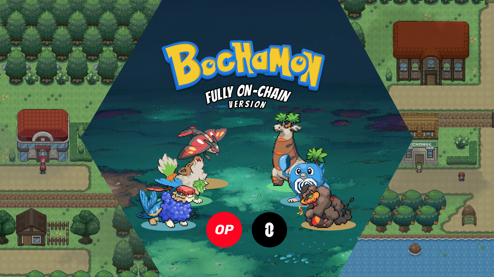

# Bochamon

_Fully on-chain turn-based_ game with multi-chain rewards. Bochamon is an _Autonomous World_ that can be deployed in any OP rollup and its rewards can be bridged between all the supported chains by _Layer-Zero_.



## Description

This project combines _Pokemon-like_ games and _Blockchain_.

While playing this game your current position on the map is stored in the blockchain and _updated after every move_, you can pick your Bochamons and _set up your team_ (also registered in the blockchain) and you can _fight other players_ (every action is also a blockchain transaction).

After winning a duel, you get _rewarded in BochaCoins_. These coins are deployed as an ERC20 contract in OP Mainnet and we set up a bridge to Base with the Layer-Zero. Talking with the Exchange NPC allows you to _bridge_ the coins!

Our initial idea was to deploy it also to _Base Mainnet_ and _Zora_, so you can move your BochaCoins between all the chains, but the cost of deploying to Mainnet the contracts was too high.

## How it's made

The first step to build this project was deciding what lib we were going to use to create the game contracts. We already have experience using _MUD_ so we decided to use it for this project, it also allows us to use the open-source lib _Garnet_ to create the backend that integrates automatically with MUD.

With the idea of building the game using MUD, we deployed a Testnet for local development, we started to look for _free assets_ for the game and set up a _Unity project_ to have a game client.

To connect the Blockchain with Unity we needed a _backend_, and we created one in _Go_. This backend provides a WebSocket connection to the Unity client. Connecting to that Websocket the clients can _read the state_ of the game, _send transactions_ and _register_ new users.

One of our goals was to make the game multi-chain so we make a quick demo with _Layer-Zero_ connecting _OP Mainnet_ and _Base_ to send ERC20 between both chains, it took some time but we were able to make it work. After that, we just needed to add the new message to the backend and create the same transaction programmatically there.

At this point we have everything ready to deploy to OP Mainnet, so we create a free account at _Alchemy_ to have a rest endpoint available, and we _bridge_ some ETH to OP Mainnet.

The last step was deploying the contracts to OP Mainnet: here we encounter a _problem_, MUD's deployment scripts were breaking when connecting to OP Mainnet. We found out that the issue was that the contracts were too big to estimate the _gas consumption_ using the rest endpoints, we "hack" the _node modules_ folder and hardcoded the _gas limit_ instead of using the estimation. After that change, we were able to deploy the OP Mainnet!

With everything on OP Mainnet and little time in the clock before the hackathon ends. We move a little bit on the map, we set up our Bochamons, fight a duel and use the bridge to record the video.

We realized that the costs of having that public are going to be high, so after the video was recorded we _turned off the backend_ pointing to OP Mainnet and release a new version _running on Localnet_ without the bridge active to have it public, so anybody can _play the game_.

## Dependencies

We used _open-source_ libs to build the game and read the state of the Blockchain:

- All the solidity contracts are built using [MUD](https://github.com/latticexyz/mud).
- Using [Garnet](https://github.com/bocha-io/garnet) we are able to index all the MUD transactions and it provides an in-memory database to access the information.
- Using [txbuilder](https://github.com/bocha-io/txbuilder) we are able to create, sign and broadcast transactions.
- Using [game-backend](https://github.com/bocha-io/game-backend) we are able to expose all the functionality using websockets.

NOTE: the first version of the last 3 libs were created in a previous hackathon [AWs-Garnet](https://ethglobal.com/showcase/garnet-bkgrp)

The client was written using Unity, we connected it to the Backend's WebSocket to get the chain information and send user actions.

## Mainnet info

Game:

- Main World Contract: [0x69e5e379c4264a9df3581c7743b3c0031cf0a817](https://optimistic.etherscan.io/address/0x69e5e379c4264a9df3581c7743b3c0031cf0a817)
- The same wallet that deployed the contracts it the one in charge of registering the match actions: [0x773fd42078335a1e60b4f856d37f33b901cc9953](https://optimistic.etherscan.io/address/0x773fd42078335a1e60b4f856d37f33b901cc9953)

- Example player wallet: [0x79A57fFb8909d1E41d77370C7f9E4878D1FbE281](https://optimistic.etherscan.io/address/0x79A57fFb8909d1E41d77370C7f9E4878D1FbE281)

Tokens:

- OP Mainnet deploy ERC20 token [0xe0BA560EF4fA8f2DC647d3DefF900005d53f8607](https://optimistic.etherscan.io/address/0xe0BA560EF4fA8f2DC647d3DefF900005d53f8607)
- Deploy proxyOFT contract in OP Mainnet [0xE77710Ae15c5F9F1b8E31135ca4f5FBe5bEc2097](https://optimistic.etherscan.io/address/0xE77710Ae15c5F9F1b8E31135ca4f5FBe5bEc2097)
- Deploy OFT contract and connect it to OP Mainnet [0xe0BA560EF4fA8f2DC647d3DefF900005d53f8607](https://basescan.org/address/0xe0ba560ef4fa8f2dc647d3deff900005d53f8607)

Bridge:

- Approve sender: [0x4c8c1e3acd7ce53901df808e3f80b3c1d00d264edb378794df88b2c8b414cbbc](https://optimistic.etherscan.io/tx/0x4c8c1e3acd7ce53901df808e3f80b3c1d00d264edb378794df88b2c8b414cbbc)
- SendFrom OP to Base: [0xe3e8b1fea3dfad814bcb687cdd411329c6f82533c4fca469def8c00c1ad79b5c](https://optimistic.etherscan.io/tx/0xe3e8b1fea3dfad814bcb687cdd411329c6f82533c4fca469def8c00c1ad79b5c)
- Layer-Zero scan: [0xe3e8b1fea3dfad814bcb687cdd411329c6f82533c4fca469def8c00c1ad79b5c](https://layerzeroscan.com/111/address/0xe77710ae15c5f9f1b8e31135ca4f5fbe5bec2097/message/184/address/0xe0ba560ef4fa8f2dc647d3deff900005d53f8607/nonce/3)
- Dst account on Base:[0x79A57fFb8909d1E41d77370C7f9E4878D1FbE281](https://basescan.org/address/0x79A57fFb8909d1E41d77370C7f9E4878D1FbE281)

## Project Structure

- MUD contracts: `./backend/contracts-builder/contracts`
- Go backend: `./backend`
- Unity client: `./frontend`
- Bridge contracts: `./layerzero-contracts`

## Configuration and Usage

To run the code locally:

- Set up your private key in the `.env` file in `backend/contracts-builder/contract`

- Edit the make file to support your `nvm` path or if you have node globally installed just remove the `nvm` path from the `init-contracts` and `contracts` actions.

- Deploy the game contracts:

```sh
cd backend
make init-contracts
make contracts
```

- OPTIONAL: Deploy your layer-zero contracts, they are located in the `layerzero-contracts` folder, the code there is just a "copy and paste" from their solidity examples. We have them in that folder to generate the ABI.

- Configure the backend by editing the `run.sh` file to fit your needs.

- Run the backend with `./run.sh` inside the `backend` folder. It will create an `indexerlogs.log` file.

- Open the `frontend` folder in Unity and build the project to run it.

## Things missing

We wanted to implement more things but we run out of time:

- Display ETH and Bochacoins balances in the client.
- Validate ETH and Bochacoins balances before sending a transaction in the backend.
- Instead of sending User actions as plain text to the server, it should be a personal ethereum message that can be validated on-chain.
- Add music to the game.
- Deploy the in more than one network.
- Clean up WebSockets connections in the backend to fix a memory leak.

## Assets

### Bochamons

- Tobishimi, Baobaffe, Firomenis, Crobarett design by PrincessPhoenix
- Howliage,Mobiusk design by Magiscarf
- Flarezael design by Lucrain
- Sunnydra design by KajiAtsui

### Map

- Map tiles by [Zeo254](https://www.deviantart.com/zeo254)

### Characters

- Trainer by [pizzasun](https://www.deviantart.com/pizzasun) and [tebitado15](https://www.deviantart.com/tebited15)
- NPCs by [purplezaffre](https://www.deviantart.com/purplezaffre)
